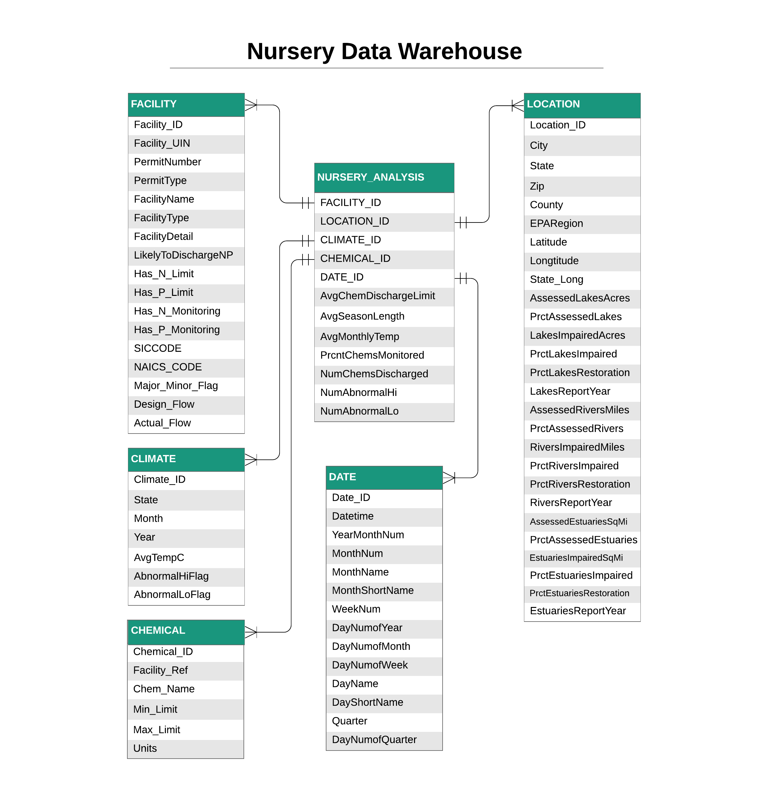

# NurseryWarehouse
A data warehouse designed to provide business analysis functionality for an emerging plant nursery company looking to expand to new locations.  Uses EPA, NOAA datasets.

## Links to Data
- [Data downloads](https://gispub2.epa.gov/NPDAT/DataDownloads.html) - dead link as of 2023
- [Facilities Likely to Discharge N/P to Water](https://gispub2.epa.gov/NPDAT/downloads/npdes_met_20150721.html) - dead link as of 2023
- [More Spreadsheets](https://www.epa.gov/nutrient-policy-data/waters-assessed-impaired-due-nutrient-related-causes) - **still live**

See `/data` directory for raw and transformed data.

## How to Build PostgreSQL Database

Using the SQL scripts in `/SQL`, a PostgreSQL database can be built, along with indexes.  It uses the data available in `/data/transformed_data`.

[Link to main SQL script to build database](/SQL/nursery_buildDB.sql)

**See the [ERD](#Entity-Relationship-Diagram) for the database schema.** 

## Intro & Project Goals

The overarching goal of this project is to leverage data from the Environmental Protection Agency (EPA) and National Oceanic and Atmospheric Administration (NOAA) to aid in the expansion of a plant nursery company that is looking to expand to new locations in the United States.  They sell plants, seeds, topsoil, equipment, and more.  This company is flexible in where it would like to set up a new location, however, there are a number of geographical, meteorological, environmental, and other characteristics that come into play when choosing a new location.  

For this project, I focused on climate and water pollution data. The  EPA  has  numerous datasets  available  regarding  water  pollution  and  nutrient impairment of rivers, estuaries, and lakes.  NOAA has a variety of datasets with climate and other weather-related information at state, county, and zip-code grains that proved to be very useful for this project. With the two of these agencies’ datasets properly combined and formatted in a data warehouse, the nursery company has the ability to analyze relevant environmental and climatic factors that may affect sales in different locations in the USA.

I want to make the data warehouse simple for basic queries, while at the same time making sure that there is significant depth within the dimension tables and that they cover a wide range of relevant details that are easy to use for analysis.  Water pollution is a significant factor in the possibility of growing plants, and climate is as well. These two factors were focused on for this project, however, there is much more that could be incorporated into this data warehouse in the future.

## Business Need

There are some assumptions that I’ve made about this business that are important.  First, I’m assuming that this data warehouse is not concerned with financial incentives of moving to one location or another, i.e. different rent costs for property, shipping costs, importing  dangerous goods,  and  more.  There are obvious  financial  implications  in choosing a location that would sell more products, in possibly more months of the year than current locations, and at higher rates, but I did not incorporate any financial details into the data warehouse.

Business performance is dependent on a long season with stable temperatures. New England is automatically a no-go simply due to the weather, and many other northern states are off the consideration list.  What really needs to be analyzed is stability in weather (long growing seasons with limited temperature spikes) and water/soil nutrients that would make or break the growing potential of plants.If the area is simply not up to the task for people to enjoy gardening or growing other plants, then there’s no reason to put a nursery there.

## Business Questions

Some business questions that are important in this endeavor include:
1. What area has the most consistent, longest growing season where the company could set up a shop and increase its sales?
2. Which current area is losing its ability for a consistent growing season?
3. Which states are taking environmental pollution seriously that could affect the bottom line of growing performance?
4. Where are temperature abnormalities a problem for growing?
5. Where is the temperature high enough to sell plants year-round?
6. When should stock be reduced during the season in a specific location?
7. Where is water quality good/bad for growing plants?
8. Where is water quality diminishing (and re-bounding) due to pollution?

## Entity-Relationship Diagram

The fact table `NURSERY_ANALYSIS` connects to 5 dimensions: `FACILITY`, `LOCATION`, `CLIMATE`, `DATE`, and `CHEMICAL`.  Between these 5 dimensions of information, there is a wealth of analysis that can be done.

The fact table hosts some derived attributes based on the dimensions that include information like:

- average chemical discharge limit
- average season length
- average monthly temp
- percent of chemicals being monitored at the facility
- number of chemicals being discharged
- number of abnormal high and low temperatures within that area

## `NURSERY_ANALYSIS`
The fact table has a number of attributes that are very useful for analysis:

1. `AvgChemDischargeLimit`: Taken from `CHEMICALS`, this is the average rate at which chemicals are being discharged per each individual facility.
2. `AvgSeasonLength`: The average stretch of months where the temperature stays at or above 50 degrees Fahrenheit (10 Celsius) to support growing a wide variety of plants.
3. `AvgMonthlyTemp`: The average monthly temperature (in Celsius) of the state in which the facility is located in.
4. `PrcntChemsMonitored`: The percentage of chemicals that are being discharged from a facility and actively monitored.  Unfortunately, many facilities don’t even monitor how much they are polluting.
5. `NumChemsDischarged`: The count of unique chemicals being discharged from the facility.
6. `NumAbnormalHi` and `NumAbnormalLo`: Derived  from  `CLIMATE`,  the  number  of  abnormal  high  temperature  and  low temperature days in a given state per each year.

## `FACILITY`
The facility dimension holds information regarding each individual facility that the EPA is tracking with respect to pollution into natural waters.  Each facility entry has a unique ID, permit type, name, and more.  The EPA has also noted whether or not the facility even monitors its own discharge, and if they have limits (`Has_N_Monitoring`, `Has_N_Limit`). They have also added how much the facility is designed to discharge, versus how much in reality it actually is. These characteristics can say a lot about the facility.

## `LOCATION`
The location dimension tells the business everything they need to know about a specific area, down to the zip code grain.  It incorporates the 3 EPA tables (impaired estuaries, lakes, rivers) to provide additional details about the assessment and recovery of these bodies of water in a certain area.This can say a lot about the area in question and what sort of effort is being done to keep the environment nutritionally stable for surrounding life.

## `CLIMATE`
The climate dimension stems directly off of the subset of data that I pulled from my NOAA GHCND database  project. This  is  all data  from NOAA, that provides the business with average temperatures for each state for each month.  I then derived an attribute named `AvgTempC` to track the average temperature in the area historically.  Using the algorithms that I talked about in the Python transformation section, I also derived two additional attributes to track the abnormal high and low temperatures that had occurred in thearea.This says a lot about the variability and extreme temperature spikes of the areawhich could kill plants.

## `CHEMICAL`
As mentioned before, the chemical dimension was transformed from a very wide subset of the Facilities Likely to Discharge N/P dataset into a long, narrow dataframe that tracks each chemical being discharged from each facility.  This makes it easy to connect the dimension’s details for a specific facility and analyze what is happening in regard to the rates of discharge, limits, and which specific chemicals are present.  I also used thedetails of this dimension to derive the number of chemicals being discharged and the percent that were actually being monitored for the single fact table `NURSERY_ANALYSIS`.

## `DATE`
The date dimension is nothing too complex; each row in the fact table has a date ID that tells the business when these observations were made. From there it is broken up into different combinations and attributes of that date, say DayName like “Tuesday” and Quarter, WeekNum, etc.
